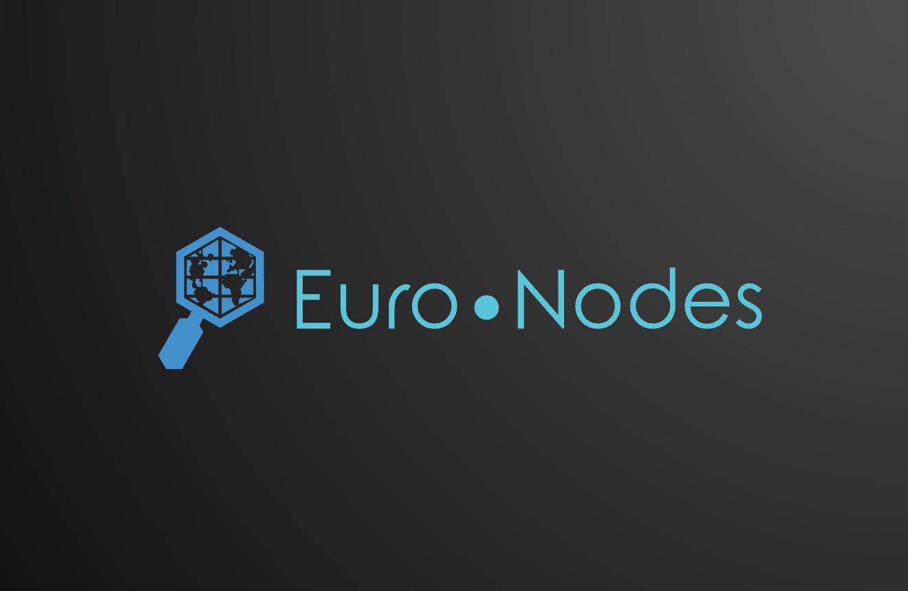
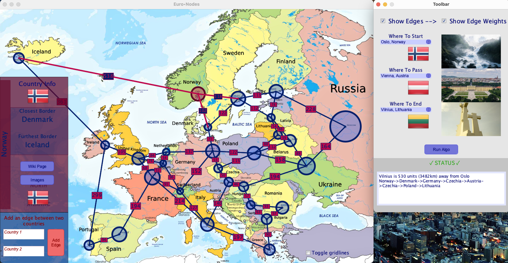
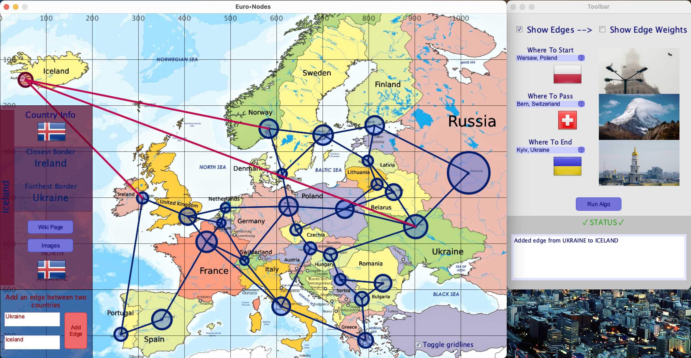
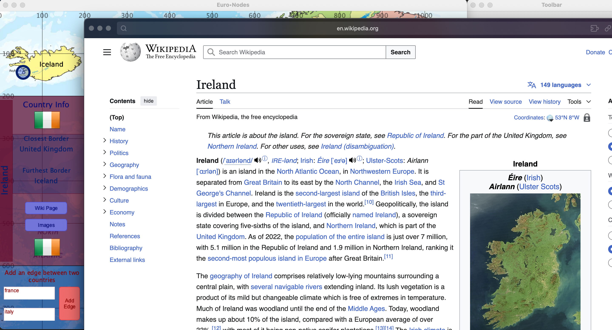

# Euro•Nodes
## ICU4UI Final Project

Libraries required.
Go to sketch > import libraries > manage libraries and install G4P and HTTP Requests for Processing

### Uses dijkstra's shortest path algo and multiple API calls

### Buttons

